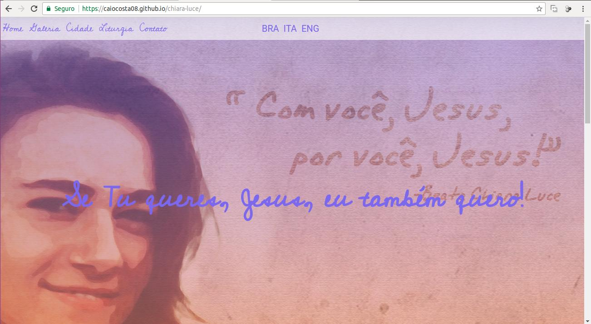
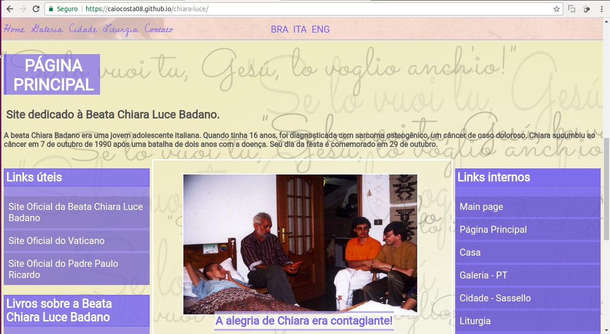
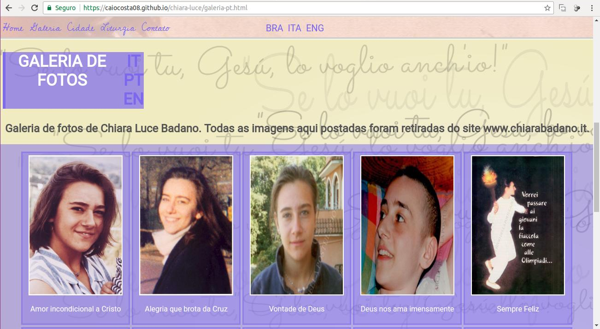
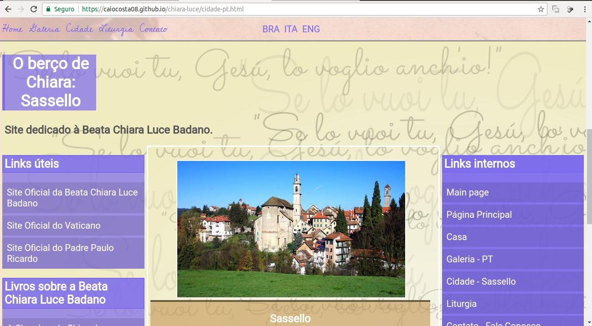
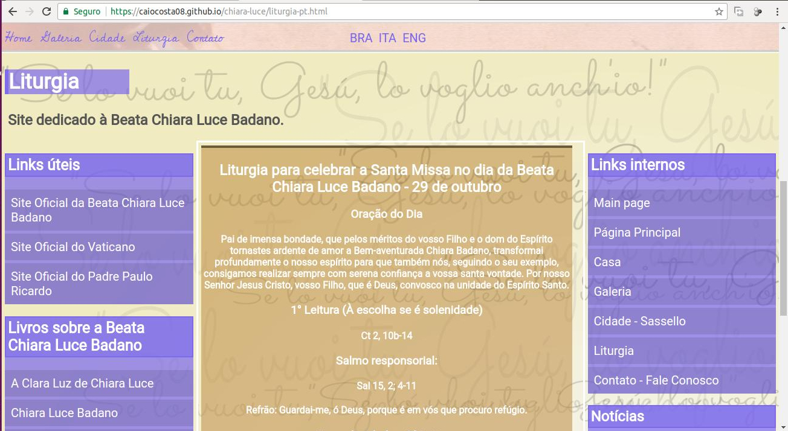

# Chiara Luce
### Repositório dedicado ao projeto final da disciplina de Linguagem de Marcação.
## Caio Henrique Carneiro de Lima e Costa - 20162610014
# CHIARA-LUCE
## Descrição: O site está dividido em uma página inicial, uma galeria de fotos, uma página dedicada à cidade natal de Chiara Luce, uma página que mostra a Liturgia da Missa no dia dedicado a ela e uma página contendo um formulário de contato. 

## Objetivo: Concluir a terceira nota da disciplina com um projeto de website dedicado à Beata Chiara Luce.
## Inspiração: Devoção à Beata Chiara Luce que, com seu exemplo de vida, nos mostra como enfrentar as dores e oferecê-las a Deus.
## Screenshots:
### 

### 

### 

### 

### 
